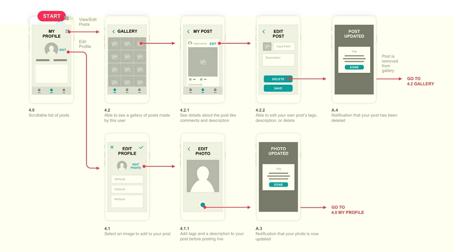

# Projeto de Interface

Visão geral da interação do usuário pelas telas do sistema e protótipo interativo das telas com as funcionalidades que fazem parte do sistema (wireframes).

 Apresente as principais interfaces da plataforma. Discuta como ela foi elaborada de forma a atender os requisitos funcionais, não funcionais e histórias de usuário abordados nas <a href="2-Especificação do Projeto.md"> Documentação de Especificação</a>.

## User Flow

Fluxo de usuário (User Flow) é uma técnica que permite ao desenvolvedor mapear todo fluxo de telas do site ou app. Essa técnica funciona para alinhar os caminhos e as possíveis ações que o usuário pode fazer junto com os membros de sua equipe.

> **Links Úteis**:
> - [User Flow: O Quê É e Como Fazer?](https://medium.com/7bits/fluxo-de-usu%C3%A1rio-user-flow-o-que-%C3%A9-como-fazer-79d965872534)
> - [User Flow vs Site Maps](http://designr.com.br/sitemap-e-user-flow-quais-as-diferencas-e-quando-usar-cada-um/)
> - [Top 25 User Flow Tools & Templates for Smooth](https://www.mockplus.com/blog/post/user-flow-tools)

## Wireframes

 ### Registro de Usuário
 A tela de registro de usuário apresenta um menu central com as opções para preenchimento do usuário, como nome, e-mail, fotos e outros, além de um botão para finalizar o registro. Na parte superior, há uma barra de navegação com os elementos de contato, login e informações sobre a empresa.
 

 ### Registro de Serviço
A tela de registro de serviço apresenta um menu central com as opções para preenchimento do usuário, como nome do serviço ofertado, e-mail, fotos e outros, além de um botão para finalizar o registro. Na parte superior, há uma barra de navegação com os elementos de contato, login e informações sobre a empresa.

### Login
A tela de login apresenta um menu central com as seções para o usuário inserir seu e-mail ou telefone e senha. Ademais, na parte inferior desse menu há opções de login utilizando a vinculação com outras contas, como Google e Facebook.Na parte superior, há uma barra de navegação com os elementos de contato, login e informações sobre a empresa.

 ### Perfil do Usuário
 A tela de perfil do usuário apresenta a área central com um campo para inserir uma foto de capa, abaixo a foto de perfil do usuário, junto há informações pessoais. Abaixo da foto de capa e ao lado da foto/ informações sobre o usuário, um campo(opcional) para descrição de informações relevantes a gosto do usuário, bem como um campo para “destaques	“ e abaixo uma galeria de fotos na forma de uma grade. Na parte superior, há uma barra de navegação com os elementos de contato, login e informações sobre a empresa.
 

 
### Tela de pesquisa

A tela de pesquisa apresenta o cabeçalho na parte superior, embaixo dele apresenta a barra de pesquisa para o usuário pesquisar o serviço que o interessa, link de busca para que ele consiga ir para a página que tenha o resultado esperado, e, um botão com o símbolo X, caso ele desista de fazer sua pesquisa. Na parte inferior terão sugestões de pesquisas relacionadas ao o que ele busca.

### Tela de agendamento de serviços

A tela de agendamento de serviços apresenta o cabeçalho na parte superior. Nela, o usuário poderá buscar o serviço que precisa; irá aparecer uma lista de profissionais e suas especialidades, ele poderá selecionar o profissional, data e horário para o serviço ser realizado. Poderá escrever no campo de observação alguma(as) observação que tenha, e, se quiser, terá a opção de receber um lembrete do serviço. No final, deverá clicar em finalizar, ou, poderá clicar no "X" se não quiser agendar um serviço.

### Tela de processos de pagamento

A tela de processos de pagamento apresenta o cabeçalho na parte superior. Nela, o usuário encontrará opções de pagamento que pode utilizar; caso ele queira fazer um pix,  será direcionado para a tela de pagamento via pix. Caso queira adicionar um novo cartão, basta clicar no botão adicionar novo cartão, que irá para a página de adicionar o cartão. E, caso queira utilizar um cartão já salvo, basta escolher a opção desejada que ele irá para a pagina dos cartões salvos.

### Tela de pagamento via pix

A tela de pix apresenta como será feito o pagamento via pix. Nela, o cabeçalho está na parte superior.O pix como título e a chave para pagamento abaixo. Após realizar o pagamento, o usuário deverá enviar o comprovante do mesmo, em seguida, deverá clicar em salvar.

### Tela de adicionar novo cartão

A página de adicionar novo cartão apresenta um formulário que o usuário irá responder conforme solicitado, assim que terminar de preencher, deverá clicar em salvar, ou, se não quiser adicionar um novo cartão, ele pode clicar no "X" na parte superior.

### Tela de selecionar cartões salvos

A tela de selecionar cartões salvos apresenta os cartões já salvos pelo usuário. Ele deve clicar no cartão que irá usar ,e, será redirecionado para a tela de pagamento via cartão desejado.

 
### Tela de pagamento via cartão de crédito

A tela de  pagamento via cartão de crédito apresenta o cabeçalho na parte superior.Nela, o icone do cartáo e o numero do cartão escolhido estarão abaixo do cabeçalho, em seguida, o usuário poderá escolher a opção de parcelamento. Após prencheer, ele deverá clicar em confirmar para prosseguir para o pagamento ou em cancelar caso nao deseje pagar com este cartão.

### Tela de pagamento via cartão de débito

A tela de  pagamento via cartão de débito apresenta o cabeçalho na parte superior.Nela, o icone do cartáo e o numero do cartão escolhido estarão abaixo do cabeçalho, em seguida, o usuário poderá clicar em confirmar para prosseguir para o pagamento ou em cancelar caso nao deseje pagar com este cartão.

### Tela de avaliar cliente

A página de avaliar a experiência que um profissional teve com determinado cliente apresenta o cabeçalho na parte superior. Na parte inferior, apresenta a foto do cliente, seu nome e descrição do serviço que ele solicitou. Embaixo há ícones de estrela para o profissional marcar conforme sua experiência, e, caso queira ele poderá fazer um comentário. Ao final ele deverá clicar em salvar.

### Tela de avaliar profissional

A página de avaliar a experiência que um cliente teve com determinado profissional apresenta o cabeçalho na parte superior. Na parte inferior, apresenta a foto do profissional, seu nome e descrição do serviço prestado. Embaixo há ícones de estrela para o cliente marcar conforme sua experiência, e, caso queira ele poderá fazer um comentário. Ao final ele deverá clicar em salvar.

### Denúncias
O canal de denúncias apresenta um menu central com as seções para o usuário inserir um título para a denúncia, descrição do ocorrido, anexo de evidências para a acusação, dados de contato e privacidade. Ademais, na parte inferior desse menu há um botão para realizar a denúncia .Na parte superior do site, há uma barra de navegação com os elementos de contato, login e informações sobre a empresa.

### Suporte ao Cliente
O canal de suporte ao cliente apresenta um menu central com um desenho da empresa, ao lado informações de contato e abaixo  as seções para o usuário inserir dados de contato e descrição para entrar em contato. Ademais, na parte inferior desse menu há um botão para realizar a solicitação. Na parte superior do site, há uma barra de navegação com os elementos de contato, login e informações sobre a empresa.

### Tela de notificações

A tela de notificações apresenta o cabeçalho na parte superior. A intenção é que ela funcione como um pop-up, que irá aparecer quando o usuário quiser sair de uma página antes de respondê-la completamente. Ele poderá fechá-la clicando no "X".

### Tela de sair

A tela de sair aparecerá quando um cliente quiser sair de uma página que ele não tenha salvado ou preenchido os dados solicitados.

### Mensagens e chat
É composto por uma menu lateral com os perfis que o usuário possui interação, ao clicar em um perfil será apresentado um menu central com as mensagens trocadas pelos usuários. A esquerda da tela ficará o receptor, enquanto a esquerda o emissor(usuário), dessa maneira, será possível visualizar o nome e a foto de perfil de cada usuário, bem como seu status. Na parte superior, há uma barra de navegação com os elementos de contato, login e informações sobre a empresa.

### Home 
Página inicial do site onde mostra um carrossel e as opções de login ou sign-up.

### Lista trabalho
Lista onde se encontra os colaboradores 

### Painel
Página onde o colaborador poderá acessar a página de pagamentos e serviços recentes por ele feitos

## Favoritos
trata-se de uma página que armazena os serviços e os colaboradores Favoritos do cliente;

### Detalhes do profissional
Página que mostra o perfil detalhado do profissional escolhido

> **Links Úteis**:
> - [Protótipos vs Wireframes](https://www.nngroup.com/videos/prototypes-vs-wireframes-ux-projects/)
> - [Ferramentas de Wireframes](https://rockcontent.com/blog/wireframes/)
> - [MarvelApp](https://marvelapp.com/developers/documentation/tutorials/)
> - [Figma](https://www.figma.com/)
> - [Adobe XD](https://www.adobe.com/br/products/xd.html#scroll)
> - [Axure](https://www.axure.com/edu) (Licença Educacional)
> - [InvisionApp](https://www.invisionapp.com/) (Licença Educacional)
